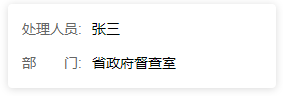

# 技术积累 - 其他

## 目录

- [技术积累 - 其他](#技术积累---其他)
  - [目录](#目录)
  - [移动端开发](#移动端开发)
    - [解决移动端唤起键盘时键盘遮住输入框问题](#解决移动端唤起键盘时键盘遮住输入框问题)
  - [CSS 布局技巧](#css-布局技巧)
    - [单行文本对齐](#单行文本对齐)
  - [服务器运维](#服务器运维)
    - [生成私钥和公钥](#生成私钥和公钥)
    - [SSH 连接问题解决](#ssh-连接问题解决)
      - [问题1：中间人攻击警告](#问题1中间人攻击警告)
      - [问题2：Permission denied 错误](#问题2permission-denied-错误)
  - [开发工具配置](#开发工具配置)
    - [VSCode + Vim 使用心得](#vscode--vim-使用心得)
      - [标注位置功能](#标注位置功能)
      - [Visual 模式下快速包裹文字](#visual-模式下快速包裹文字)
  - [Vue.js 开发](#vuejs-开发)
    - [网络请求相关](#网络请求相关)
      - [发送 application/x-www-form-urlencoded 请求](#发送-applicationx-www-form-urlencoded-请求)
      - [Axios 封装](#axios-封装)
      - [切换 Tab 时取消网络请求](#切换-tab-时取消网络请求)
    - [组件开发技巧](#组件开发技巧)
      - [阻止 el-checkbox 冒泡事件](#阻止-el-checkbox-冒泡事件)
    - [页面交互实现](#页面交互实现)
      - [页面滚动时 Tab 切换](#页面滚动时-tab-切换)
    - [构建配置](#构建配置)
      - [VuePress 解决第三方包全局变量问题](#vuepress-解决第三方包全局变量问题)
      - [Vue CLI 5.x 项目图片打包配置](#vue-cli-5x-项目图片打包配置)
  - [JavaScript 基础](#javascript-基础)
    - [对象操作](#对象操作)
      - [判断对象自身为空](#判断对象自身为空)
    - [模块化使用](#模块化使用)
      - [在 HTML 中使用 CommonJS 或 ES Module](#在-html-中使用-commonjs-或-es-module)
  - [系统操作](#系统操作)
    - [Mac 系统](#mac-系统)
      - [环境变量配置](#环境变量配置)
      - [查看端口使用情况](#查看端口使用情况)
    - [Windows 系统](#windows-系统)
      - [查看端口使用情况](#查看端口使用情况-1)

---

## 移动端开发

### 解决移动端唤起键盘时键盘遮住输入框问题

以 vant 为例的完整解决方案：

**HTML 结构：**
```html
<van-popup
  v-model="isShowPopup"
  :class="isFocus ? 'popup-container' : ''"
  round
  position="bottom"
  closeable
  close-on-click-overlay>
  <div ref="thly">
    <van-field
      v-model="applyDoneParams.content"
      colon
      label-width="4.5em"
      name="thly"
      label="申请理由"
      type="textarea"
      maxlength="200"
      placeholder="请输入申请理由"
      @focus="handleFocus"
      @blur="isFocus = false"
      required />
  </div>
</van-popup>
```

**JavaScript 逻辑：**
```javascript
data() {
  return {
    windowInnerHeight: 0,
    isFocus: false,
  }
},
mounted() {
  this.windowInnerHeight = window.innerHeight;
},
methods: {
  handleFocus() {
    setTimeout(() => {
      // 当软键盘的高度包含在 window.innerHeight 之中时，window.innerHeight 会随着软键盘的弹出而变小,
      // 这时可以使用 scrollIntoView() 将当前元素滚动到可视区域
      if (this.windowInnerHeight > window.innerHeight) {
        this.scrollIntoViewByFocus(this.$refs.thly)
      } else {
        // 当软键盘的高度不包含在 window.innerHeight 之中时(比如某些鸿蒙系统的手机), 则需要通过其他方法将元素滚动到可视区域(margin 或者 fixed)
        this.isFocus = true;
      }
    }, 300)
  },
  scrollIntoViewByFocus(dom) {
    const ua = navigator.userAgent;
    const iOS = /iPad|iPhone|iPod/.test(ua);
    setTimeout(() => {
      if (iOS) {
        if (!/OS 11_[0-3]\D/.test(ua)) {
          document.body.scrollTop = document.body.scrollHeight;
        }
      } else {
        dom.scrollIntoView(false);
      }
    }, 300);
  };
}
```

**CSS 样式：**
```css
.popup-container {
  margin-bottom: 40vh;
}
```

---

## CSS 布局技巧

### 单行文本对齐

使用 HTML + CSS 实现文本对齐效果：



**HTML 结构：**
```html
<div class="card">
  <div class="person">
    <span class="key">处理人员</span>:
    <span class="value">张三</span>
  </div>
  <div class="dept">
    <span class="key">部门</span>:
    <span class="value">省政府督查室</span>
  </div>
</div>
```

**CSS 样式：**
```css
.card {
  width: 240px;
  padding: 14px;
  background:#ffffff;
  box-shadow:0px 1px 8px rgba(0, 0, 0, 0.15);
  border-radius: 4px;
  > div {
    display: flex;
  }
  .person {
    margin-bottom: 12px;
  }
  /* 重要：实现文本对齐的关键样式 */
  .key {
    color: #666;
    width: 4em;
    text-align: justify;
    text-align-last: justify;
  }
  .value {
    color: #000;
    margin-left: 10px;
  }
}
```

---

## 服务器运维

### 生成私钥和公钥


### SSH 连接问题解决

#### 问题1：中间人攻击警告
**错误信息：** Someone could be eavesdropping on you right now (man-in-the-middle attack)!

**解决方案：** 重新生成远程主机信息
```bash
ssh-keygen -R [远程主机IP]
```

#### 问题2：Permission denied 错误
**错误信息：** Permission denied (publickey,gssapi-keyex,gssapi-with-mic)

**解决方案：**
1. 编辑 SSH 配置文件：
   ```bash
   sudo vim /etc/ssh/sshd_config
   ```

2. 添加以下配置：
   ```bash
   PasswordAuthentication yes
   PermitRootLogin yes
   ```

3. 重启 SSH 服务：
   ```bash
   sudo systemctl restart sshd
   # 或者
   service sshd restart
   ```

4. 在对应的云服务器平台重置密码

---

## 开发工具配置

### VSCode + Vim 使用心得

#### 标注位置功能

1. 下载 bookmark 插件
2. 在 `settings.json` 中配置：
   ```json
   {
     "vim.normalModeKeyBindingsNonRecursive": [
       {
         "before": ["m"],
         "commands": ["bookmarks.toggle"]
       }
     ]
   }
   ```

#### Visual 模式下快速包裹文字

在选中文字后：
1. 按下 `Shift + S`
2. 按下 `"` 键即可快速用引号包裹选中内容

---

## Vue.js 开发

### 网络请求相关

#### 发送 application/x-www-form-urlencoded 请求

**方式1：使用 FormData**
```javascript
export const getTaskReport = data => {
  return request({
    headers: { 'Content-Type': 'application/x-www-form-urlencoded' },
    url: `/app/business/dcs/taskReport`,
    method: 'POST',
    data,
  })
}

// 使用示例
const formData = new FormData()
formData.append('key', 'value')
getTaskReport(formData).then(res => {
  this.matterList = res.resultData
})
```

**方式2：使用 qs 库（推荐）**
```javascript
import qs from 'qs'

export const getTaskReport = data => {
  return request({
    headers: { 'Content-Type': 'application/x-www-form-urlencoded' },
    url: `/app/business/dcs/taskReport`,
    method: 'POST',
    data: qs.stringify(data),
    // 或者手动拼接：
    // data: Object.entries(data).reduce((prev, curr) => `${prev}${curr[0]}=${curr[1]}&`, '')
  })
}

// 使用示例
const params = {}
getTaskReport(params).then(res => {
  this.matterList = res.resultData
})
```

> **注意：** 如果 params 中的属性是对象，需要先用 `JSON.stringify` 转换

#### Axios 封装

**request.js**
```javascript
import axios from 'axios';

const service = axios.create({
  timeout: 5 * 60000,
});

service.interceptors.request.use(
  config => {
    return config;
  },
  error => {
    console.log(error);
    Promise.reject(error);
  }
);

service.interceptors.response.use(
  res => {
    return res
  },
  error => {
    return Promise.reject(error);
  }
);

export default service;
```

**api.js**
```javascript
import request from './request';
import Qs from 'qs';

export const searchRepeated = function (data) {
  return request({
    url: `/api/searchRepeated/batchSearch`,
    method: 'post',
    headers: {
      'Content-Type': 'application/x-www-form-urlencoded; charset=UTF-8',
    },
    data: Qs.stringify(data),
  });
};
```

#### 切换 Tab 时取消网络请求

**api.js**
```javascript
export function pageItemForManagerApi(data = {}, o = {}) {
  return request({
    url: '/dataCatalog/pageItemForManager',
    method: 'post',
    data,
    ...o
  })
}
```

**组件实现**
```javascript
import axios from 'axios'
const { CancelToken } = axios
let source = CancelToken.source()

export default {
  data() {
    return {
      prevMillisecond: 0,
    }
  },
  watch: {
    // 监听 activeTabName 的变化, 如果1.5秒内连续变化, 则取消上一次请求
    activeTabName(newVal, oldVal) {
      if (newVal === oldVal) {
        return
      }
      const nowMillisecond = Date.now()
      if (nowMillisecond - this.prevMillisecond < 1500 && newVal === 'catalog') {
        source.cancel('取消上一次请求')
        source = CancelToken.source()
      }
      this.prevMillisecond = nowMillisecond
    }
  },
  methods: {
    async getData() {
      const res = await api({ ...this.params }, { cancelToken: source.token })
    }
  }
}
```

### 组件开发技巧

#### 阻止 el-checkbox 冒泡事件

```vue
<el-checkbox 
  v-model="checked" 
  @click.native="(e) => e.stopPropogation()" 
></el-checkbox>
```

### 页面交互实现

#### 页面滚动时 Tab 切换

实现滚动到某个位置时自动切换对应 tab：

```vue
<template>
  <div>
    <div class="tabs">
      <div class="tab" :class="{ active: currentTab === 'tab1' }">Tab 1</div>
      <div class="tab" :class="{ active: currentTab === 'tab2' }">Tab 2</div>
      <div class="tab" :class="{ active: currentTab === 'tab3' }">Tab 3</div>
    </div>
    <div id="section1">Section 1</div>
    <div id="section2">Section 2</div>
    <div id="section3">Section 3</div>
  </div>
</template>

<script>
export default {
  data() {
    return {
      currentTab: 'tab1',
    };
  },
  methods: {
    handleScroll() {
      const section1 = document.getElementById('section1');
      const section2 = document.getElementById('section2');
      const section3 = document.getElementById('section3');

      const scrollTop = window.pageYOffset || document.documentElement.scrollTop || document.body.scrollTop;

      if (scrollTop >= section1.offsetTop && scrollTop < section2.offsetTop) {
        this.currentTab = 'tab1';
      } else if (scrollTop >= section2.offsetTop && scrollTop < section3.offsetTop) {
        this.currentTab = 'tab2';
      } else if (scrollTop >= section3.offsetTop) {
        this.currentTab = 'tab3';
      }
    },
  },
  mounted() {
    window.addEventListener('scroll', this.handleScroll);
  },
  beforeDestroy() {
    window.removeEventListener('scroll', this.handleScroll);
  },
};
</script>

<style>
.tabs {
  position: fixed;
  top: 0;
  left: 0;
  width: 100%;
  display: flex;
  justify-content: space-around;
  background-color: #f0f0f0;
  padding: 10px;
}

.tab {
  cursor: pointer;
}

.tab.active {
  font-weight: bold;
}

section {
  height: 1000px;
  margin-top: 30px;
}
</style>
```

### 构建配置

#### VuePress 解决第三方包全局变量问题

**问题：** 导入第三方包时报错 `global is not defined`

**解决方案：** 在 `.vuepress/config.js` 文件中添加：

```javascript
module.exports = {
  configureWebpack: {
    node: {
      global: true,
      process: true,
      Buffer: true,
    },
  },
}
```

#### Vue CLI 5.x 项目图片打包配置

**将图片转换为 base64：**

```javascript
// vue.config.js

// Vue CLI 5.x 配置
module.exports = {
  chainWebpack: config => {
    config.module
      .rule('images')
      .test(/\.(jpg|png|gif|svg)$/)
      .set('parser', {
        dataUrlCondition: {
          maxSize: 20 * 1024 // 20KB
        }
      })
  }
}

// Vue CLI 4.x 配置
module.exports = {
  chainWebpack: config => {
    config.module
      .rule('images')
      .test(/\.(jpg|png|gif)$/)
      .use('url-loader')
      .loader('url-loader')
      .tap(options => Object.assign(options, { limit: 10240 })); // 10KB
  }
}
```

---

## JavaScript 基础

### 对象操作

#### 判断对象自身为空

```javascript
const obj = {}
const isEmpty = Reflect.ownKeys(obj).length === 0
```

### 模块化使用

#### 在 HTML 中使用 CommonJS 或 ES Module

**CommonJS 方式：**
1. 安装 browserify：
   ```bash
   npm install -g browserify
   ```

2. 打包文件：
   ```bash
   browserify your_file.js -o bundle.js
   ```

3. 在 HTML 中引入生成的 bundle.js

**ES Module 方式：**
1. 在 script 标签中添加 `type="module"`：
   ```html
   <script type="module" src="your_file.js"></script>
   ```

2. 使用 VSCode 的 Live Server 插件打开 HTML 文件以解决跨域问题

---

## 系统操作

### Mac 系统

#### 环境变量配置

**基本概念：**
- Mac 默认有两个 Shell：bash 和 zsh
- bash 使用配置文件：`~/.bash_profile`
- zsh 使用配置文件：`~/.zshrc`

**配置方法：**
1. 编辑配置文件：
   ```bash
   # 配置格式
   export 变量名=变量值
   
   # 追加路径示例
   export PATH=$PATH:/usr/local/bin
   ```

2. 使配置生效：
   ```bash
   source ~/.bash_profile
   # 或
   source ~/.zshrc
   ```

**注意事项：**
- 环境变量中的冒号（:）表示多个路径的分隔符
- `$PATH` 表示系统默认路径

#### 查看端口使用情况

```bash
# 查看所有正在监听的端口
netstat -antp tcp | grep LISTEN
```

### Windows 系统

#### 查看端口使用情况

```bash
# 查看所有正在监听的端口
netstat -an | findstr LISTENING

# 查看特定端口是否被使用
netstat -an | findstr :<port_number>

# 显示端口对应的进程 ID
netstat -ano | findstr :8080

# 停止指定进程（需要管理员权限）
taskkill /f /pid <pid>
```
