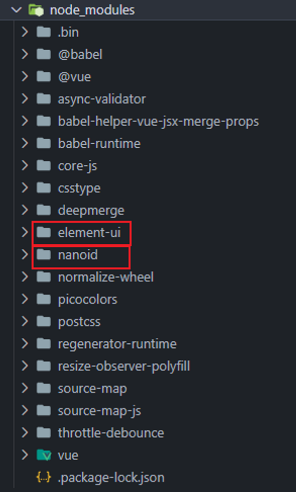
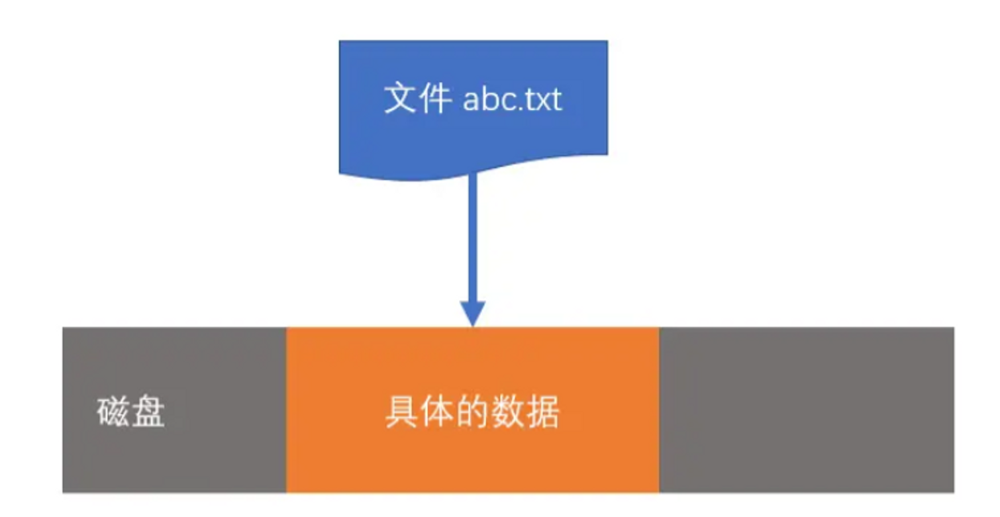
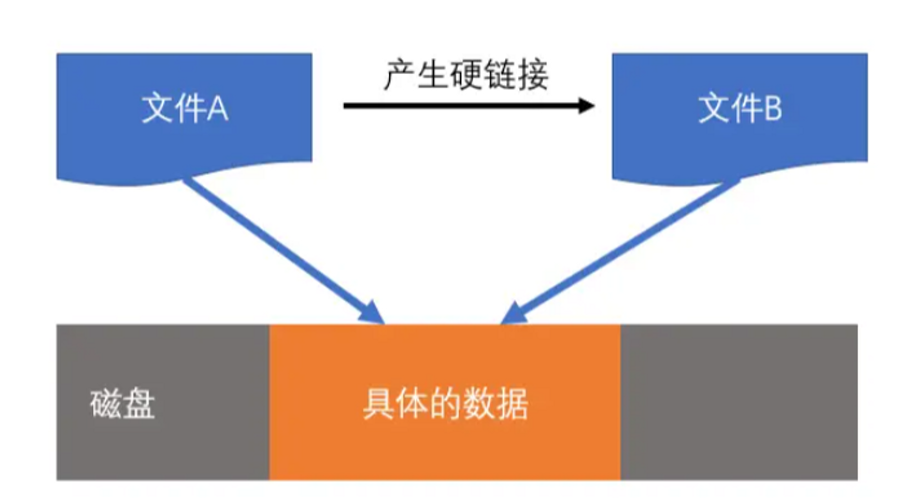
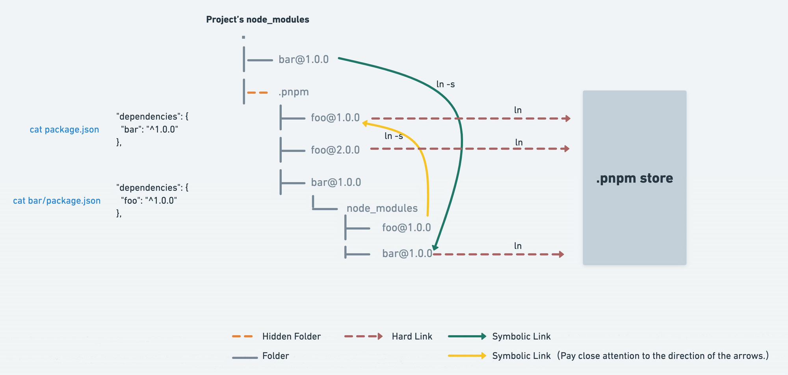

# pnpm

## npm 的缺点
1. 在使用 `npm` 或 `yarn` 时，如果你有100个项目使用某个依赖项，那么你就会在磁盘上保存该依赖项的100个副本（比如这100个项目都使用了 `element-ui`, 那么磁盘上就会保存100份 element-ui 的源码）, 非常占用空间
2. 使用 `npm` 或 `yarn` 安装依赖项时，所有的包都在 `node_modules` 的根目录。 这样就导致了一个问题，源码可以直接访问项目中依赖的依赖, 这样是不太好的（比如 `element-ui` 本身依赖 a 包, 表面上我们没有安装 a 包, 但却可以使用, 如果有一天删了 `element-ui`, 意味着 a 包也会删掉, 如果此时项目恰好引用了 a 包而忘记删除, 项目就会报错了）


## 什么是 pnpm
`pnpm`是一种Node.js包管理器，它与`npm`类似，但具有更快的安装速度和更少的磁盘空间占用。与`npm`不同，`pnpm`使用**软链接**和**硬链接**来共享依赖项，这意味着每个依赖项只需要在磁盘上存储一次，而不是每个项目都存储一次。


## 软链接和硬链接
### 1. 文件的本质
在操作系统中，文件实际上是一个指针，只不过它指向的不是内存地址，而是一个外部存储地址（这里的外部存储可以是硬盘、U盘、甚至是网络）


当我们删除文件时，删除的实际上是指针，因此，无论删除多么大的文件，速度都非常快。像我们的U盘、硬盘里的文件虽然说看起来已经删除了，但是其实数据恢复公司是可以恢复的，因为数据还是存在的，只要删除文件后再没有存储其它文件就可以恢复，所以真正删除一个文件就是**反复存反复删**

### 2. 文件的拷贝
如果你复制一个文件，是将该文件指针指向的内容进行复制，然后产生一个新文件指向新的内容。


### 3. 硬链接 hard link
硬链接的概念来自于 Unix 操作系统，它是指将一个文件A指针复制到另一个文件B指针中，文件B就是文件A的硬链接。

通过硬链接，不会产生额外的磁盘占用，并且，两个文件都能找到相同的磁盘内容。 硬链接的数量没有限制，可以为同一个文件产生多个硬链接。

windows 可以在 cmd 中使用下面的命令可以创建硬链接。
```shell
mklink /h 链接名称 目标文件
```
注意:
1. 由于文件夹（目录）不存在文件内容，所以文件夹（目录）不能创建硬链接
2. 在 windows 操作系统中，通常不要跨越盘符创建硬链接

### 4. 软链接 symbol link
软链接又称为符号链接，如果为某个文件或文件夹A创建符号连接B，则B指向A。


windows 可以在 cmd 中使用下面的命令可以创建软链接。(软链接类似快捷方式)
```shell
mklink 链接名称 目标文件
```
由于符号链接指向的是另一个文件或目录，当执行该文件时，会使用原始路径。比方说：我在D盘装了LOL，在桌面创建了LOL快捷方式，相当于是符号链接，双击快捷方式运行游戏，在运行游戏的时候是按照LOL原始路径（D盘路径）运行的。

### 5. 硬链接和软链接区别
1. 硬链接仅能链接文件，而符号链接可以链接目录
2. 硬链接在链接完成后仅和文件内容关联，和之前链接的文件没有任何关系。而符号链接始终和之前链接的文件关联，和文件内容不直接相关。


## pnpm 解决了哪些问题
1. 使用`pnpm`安装的包都会存储在硬盘上的某一位置。 当第三方包被安装时，包里的文件会**硬链接**到这一位置，而不会占用额外的磁盘空间。 这允许你跨项目地共享同一版本的依赖。
2. 如果你用到了某依赖项的不同版本，只会将不同版本间有差异的文件添加到仓库。 例如，如果某个包有100个文件，而它的新版本只改变了其中1个文件。那么 `pnpm update` 时只会向存储中心额外添加1个新文件，而不会因为仅仅一个文件的改变复制整新版本包的内容。

## pnpm 原理
使用 pnpm 安装的包都存储到哪了呢?
在 pnpm 中，会将依赖安装到当前分区的 `<home dir>/.pnpm-store` 位置中，可以通过以下命令获得当前的 store 位置：
```shell
pnpm store path
```


`pnpm`利用硬链接将所需的包从`node_modules/.pnpm`硬链接到`store`中

通过软链接将`node_modules`中的顶层依赖以及依赖的依赖软链接到`node_modules/.pnpm`中

看如下例子:
```txt
node_modules
└─ .pnpm
   └─ demo-a@1.0.0
      └─ node_modules
         └─ demo-a -> <store>/demo-a
   └─ demo-b@1.0.0
      └─ node_modules
         ├─ demo-a -> ../../demo-a/node_modules/demo-a
         └─ demo-b -> <store>/demo-b
   └─ demo-c@1.0.0
      └─ node_modules
         ├─ demo-a -> ../../demo-a/node_modules/demo-a
         └─ demo-c -> <store>/demo-c
└─ demo-b -> ./.pnpm/demo-b@1.0.0/node_modules/demo-b
└─ demo-c -> ./.pnpm/demo-c@1.0.0/node_modules/demo-c
```


看如下例子:


上面例子只执行了 pnpm add element-ui, 但是因为 element-ui 也有其他依赖项, 所以会有除了 element-ui 以外的包, element-ui@2.15.13/node_modules 下的 element-ui 文件夹下的文件硬链接到存储仓库, 其他的文件夹通过软链接找到对应的包

## pnpm 的局限性

由于全局共用同一份 `store`，因此当需要修改 `node_modules` 内的内容时，会直接影响全局 `store` 中对应的内容，对其他项目也会造成影响
