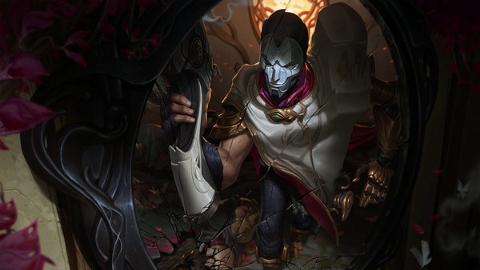

# 戏命师-烬

 

1. 每张面具背后，都是另一张面具。
2. 终有一日，我的天才定会得到理解。
3. 我于杀戮之中盛放，亦如黎明中的花朵。
4. 我从淤泥中复苏，我是灼热的青莲，我是，唯一的美。
5. 你的平庸无奇，将被我的无伦才智彻底升华。
6. 我做的只是别人不敢去做的事情，这毫无疑问是一种进步。
7. 优秀不值一提，我必须达到，完美！
8. 每颗子弹，都是我的一缕灵魂；每道枪火，都是我的一丝生命。
9. 他们叫我疯子，艺术家，都是疯子。
10. 哪一个才是谎言，是面具？还是我的脸？